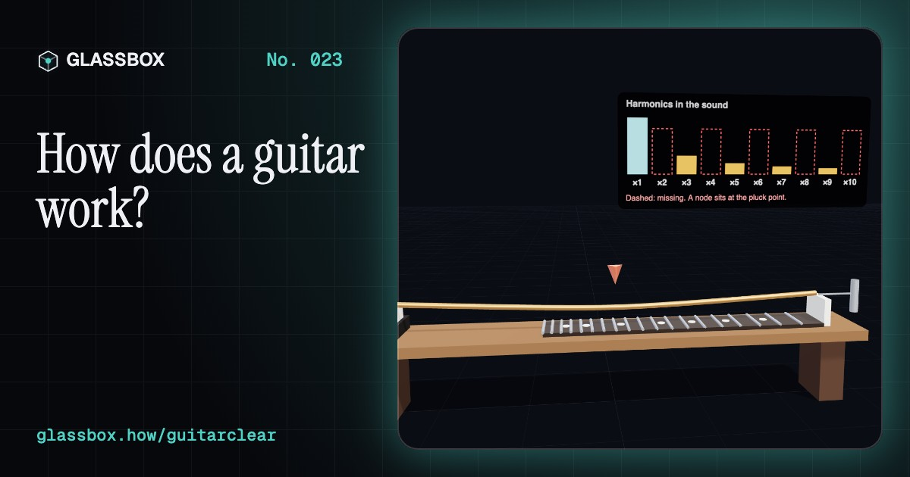
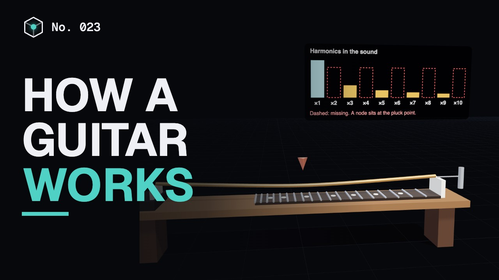
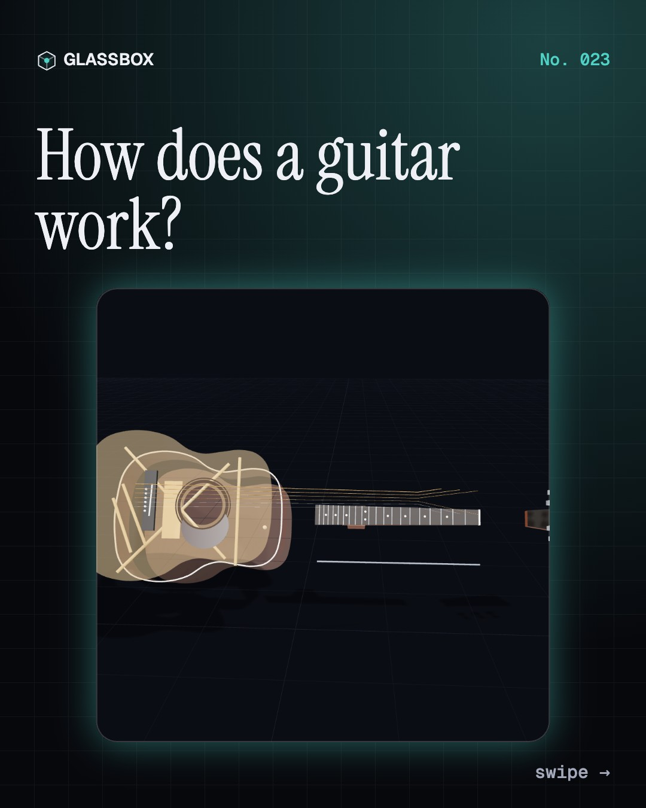
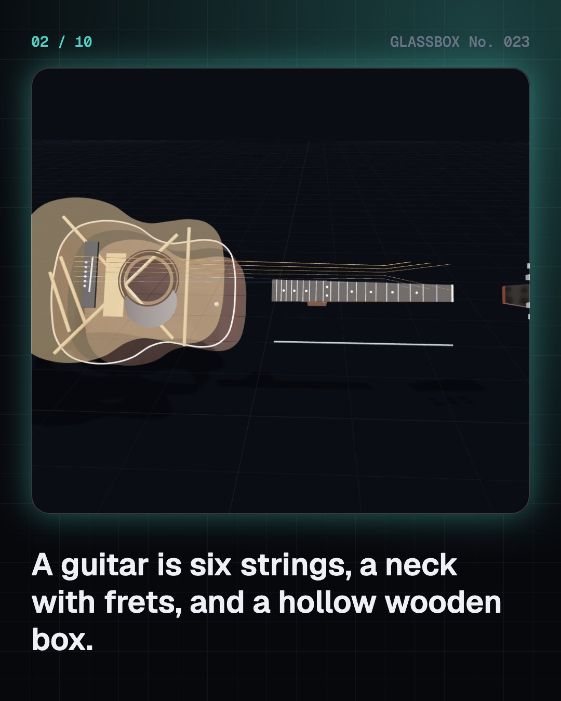
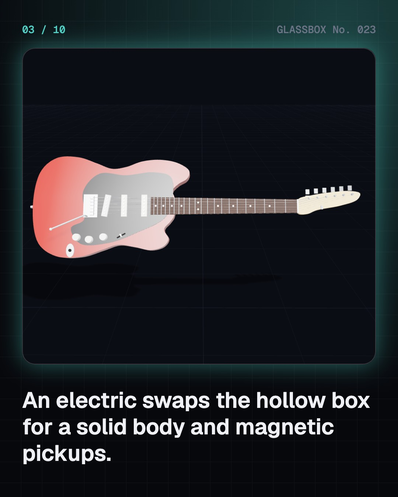
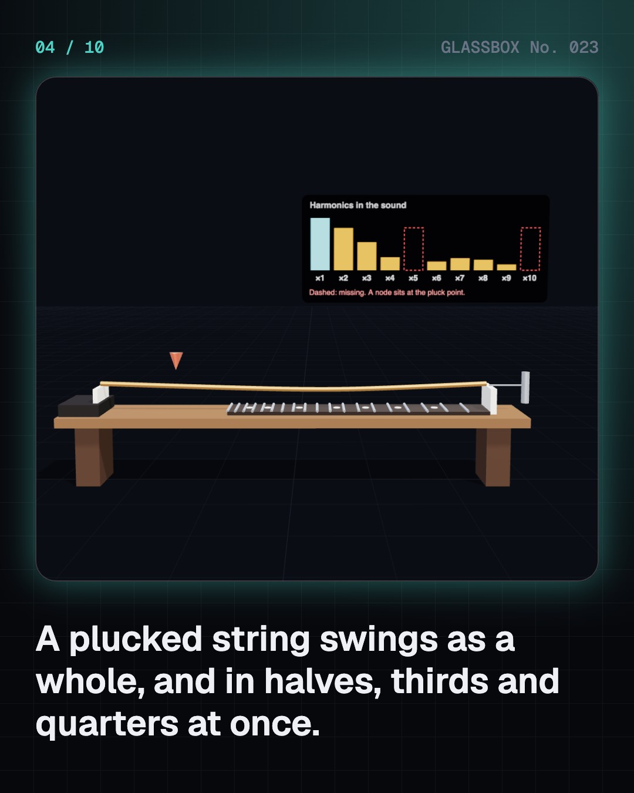

<!-- glassbox:start -->
<!-- Generated from glassbox.json by the Glassbox hub (npm run readme -- guitarclear). Edit glassbox.json, not this block. -->
<p align="center"><a href="https://glassbox.how/e/guitarclear/"></a></p>

<h1 align="center">GuitarClear</h1>

<p align="center"><b>How does a guitar work?</b><br>Six strings pulling with 73 kg, a thin spruce top that pumps the air, and a magnet that hears steel move. Pluck, fret and strum a guitar in 3D, then plug it in and push the amp until it clips.</p>

<p align="center"><a href="https://glassbox.how/guitarclear/"><b>▶ Play with it</b></a> &nbsp;·&nbsp; <a href="https://glassbox.how/e/guitarclear/">Read the 60-second explainer</a> &nbsp;·&nbsp; <a href="https://glassbox.how/guitarclear/glassbox/reel.mp4">Watch the 40-second video</a></p>

<p align="center">
  <a href="https://glassbox.how/e/guitarclear/"></a>
  <a href="https://glassbox.how/e/guitarclear/"></a>
  <a href="LICENSE"></a>
  <a href="LICENSE-CONTENT.md"></a>
  <a href="#privacy"></a>
</p>

## In 60 seconds

1. **Six strings between two points.** A guitar's strings run from the saddle on the bridge to the nut at the top of the neck. All six are the same length, so their notes, from E at 82.4 Hz to E at 329.6 Hz, are set by how tight and how heavy each one is: f = (1/2L)·√(T/μ). Together they pull with about 73 kg.
2. **Where you pluck changes the tone.** A plucked string vibrates as a whole and in halves, thirds and quarters at once. Any harmonic with a still point where you pluck goes missing, so plucking near the bridge sounds bright and plucking in the middle sounds round. Touch the string lightly at the 12th fret and only the harmonics with a node there ring: a chiming octave.
3. **Frets divide the octave into twelve.** Each fret shortens the vibrating string by the same factor, 2^(−1/12) ≈ 0.944, which raises the note one semitone. The 12th fret sits exactly halfway, 325 mm from the nut on a 650 mm classical guitar, and the frets crowd closer together as you go up.
4. **The body does the shouting.** A string alone is almost silent, because air slips around it. The bridge rocks the thin spruce top, which pumps the air like a loudspeaker, and the air in the box bounces in and out of the sound hole like air in a bottle. Together they make strong resonances near 100 Hz and 200 Hz.
5. **A pickup is Faraday's law.** An electric guitar's pickup is a magnet inside a coil of about 8,000 turns of fine wire. The moving steel string changes the magnetic flux through the coil, which makes a voltage of a few tenths of a volt. A humbucker's two reversed coils cancel mains hum but add up the string's signal.
6. **Distortion is clipping on purpose.** An amplifier makes the pickup's signal many times bigger. Push it past its limit and the tops of the wave are cut off, which adds new harmonics that were never in the string. Soft clipping, like an overdriven valve, adds them gently. Hard clipping sounds fizzier.

## Words worth knowing

| Term | Meaning |
|---|---|
| **Frequency** | How many times a second something vibrates, in hertz (Hz). The low E string vibrates 82.4 times a second. |
| **Harmonic** | A vibration of a string in 2, 3, 4… equal parts, at 2, 3, 4… times the main note. The mix of harmonics is the tone. |
| **Node** | A point on a vibrating string that stays still. |
| **Equal temperament** | A tuning where every semitone has the same frequency ratio, 2^(1/12), so twelve of them make an octave. |
| **Soundboard** | The thin wooden top of an acoustic guitar that the bridge shakes to push the air. |
| **Helmholtz resonator** | A box of air with a hole. The air in the hole bounces on the springy air inside, like blowing across a bottle. |
| **Pickup** | A magnet inside a coil of fine wire that turns a steel string's motion into a small voltage. |
| **Humbucker** | A pickup with two coils wound in opposite directions, so hum cancels while the string's signal adds. |
| **Clipping** | When a signal is pushed past an amplifier's limit, so the tops of the wave are cut off and new harmonics appear. |

## A short history

**5,000 years from a lute on a clay seal to the electric guitar, the dreadnought and the Indian slide guitar.**

- **1536** · The first book for the vihuela (Luys Milán, Valencia, Spain)
- **1779** · Six single strings (Gaetano Vinaccia, Naples, Italy)
- **1850** · An X under the top (C. F. Martin & Co., Nazareth, Pennsylvania, USA)
- **1852** · Torres builds the modern classical guitar (Antonio de Torres Jurado, Seville, Spain)
- **1931** · The Frying Pan (George Beauchamp, Paul Barth and Adolph Rickenbacker, Los Angeles, California, USA)
- **1936** · The electric guitar joins the band (Gibson; Charlie Christian, Kalamazoo, Michigan, USA)
- **1945** · The godmother of rock and roll (Sister Rosetta Tharpe, USA)
- **1950** · The first mass-produced solid-body (Leo Fender, Fullerton, California, USA)

The full story, with 29 moments, charts, people and 55 sources: [glassbox.how/e/guitarclear/history](https://glassbox.how/e/guitarclear/history/). The data lives in [`history.json`](history.json).

## Video and slides

Made with the Glassbox studio from this box's storyboard (`window.glassbox.director`). Free to reuse under CC BY 4.0.

<a href="https://glassbox.how/guitarclear/glassbox/video.mp4"></a>

<p><a href="glassbox/slide-1.jpg"></a> <a href="glassbox/slide-2.jpg"></a> <a href="glassbox/slide-3.jpg"></a> <a href="glassbox/slide-4.jpg"></a></p>

| File | What | Size |
|---|---|---|
| [`glassbox/reel.mp4`](https://glassbox.how/guitarclear/glassbox/reel.mp4) | Reel / Short, with captions and soundtrack | 1080×1920 |
| [`glassbox/video.mp4`](https://glassbox.how/guitarclear/glassbox/video.mp4) | YouTube video, with captions and soundtrack | 1920×1080 |
| `glassbox/slide-1…10.jpg` | Instagram carousel | 1080×1350 |
| `glassbox/thumb.jpg` | YouTube thumbnail | 1280×720 |
| `glassbox/cover.jpg` | Share card and repo social preview | 1200×630 |
| [`glassbox/history-reel.mp4`](https://glassbox.how/guitarclear/glassbox/history-reel.mp4) | “History in 10 moments” Reel / Short | 1080×1920 |
| `glassbox/history-slide-*.jpg` | History carousel | 1080×1350 |
| `glassbox/post.json` | Post copy and schedule used by the publish kit | |

## Privacy

This box has no accounts and no ads, and it ships its own fonts and libraries. When you run it yourself it sends nothing anywhere. On glassbox.how, the site's `/bar.js` also loads Glassbox's analytics: **Google Analytics** to count visits (it asks first in the EU, UK and Switzerland, and stays off when your browser sends Global Privacy Control or Do Not Track) and **ClickTrust** to detect bots.

It remembers a few things **in your own browser only**, and never sends them anywhere:

| Browser storage key | What it holds |
|---|---|
| `guitarclear.v1` | Which chapters you have opened, your best quiz scores, and sound on or off. |

Exactly what each one sees is at [glassbox.how/privacy](https://glassbox.how/privacy/).

## Licences

- **Code:** [MIT](LICENSE). Use it, change it, ship it.
- **Explanations, text, images and videos** (`glassbox.json`, `glassbox/`): [CC BY 4.0](LICENSE-CONTENT.md). Credit “Glassbox, glassbox.how/e/guitarclear”.
- **Third-party parts** keep their own licences: [three.js](https://threejs.org) (MIT), [Geist, Instrument Serif](https://openfontlicense.org) (SIL OFL 1.1).
- The Glassbox name and logo aren't covered by either licence. See the [terms](https://glassbox.how/terms/).

Found a mistake? [Open an issue](https://github.com/bdeeps/guitarclear/issues). Corrections happen in public.
<!-- glassbox:end -->

## Run it

It's plain HTML, CSS and JavaScript. No build step and no dependencies. Run locally, it contacts no other website.

```bash
python3 -m http.server 8000
```

Three.js and the fonts ship in `vendor/` and `fonts/`, so it also works offline.

Then open http://localhost:8000.

## How it's built

| File | What |
|---|---|
| `index.html`, `css/app.css` | The page and its styles |
| `js/app.js`, `js/stage.js`, `js/ui.js`, `js/kit.js` | The shared Glassbox 3D engine: chapters, 3D stage, controls, quiz, video director |
| `js/chapters/*.js` | One file per chapter: the 3D model, controls, text, key terms, quiz and video scenes |
| `js/guitar.js` | Guitar physics and models: string sets and tensions, fret maths, chord shapes, the WebAudio plucked-string synth and amp, vibrating strings, and the 3D acoustic and electric guitars |
| `glassbox.json` | Title, question, explainer beats, key terms, browser storage and credits shown on glassbox.how |
| `reel` in each chapter | The storyboard the Glassbox studio records into short videos |
| `glassbox/` | The published video, slides, thumbnail and post copy |
| `fonts/`, `vendor/three/` | Self-hosted Geist and Instrument Serif (SIL OFL 1.1) and three.js (MIT) |
